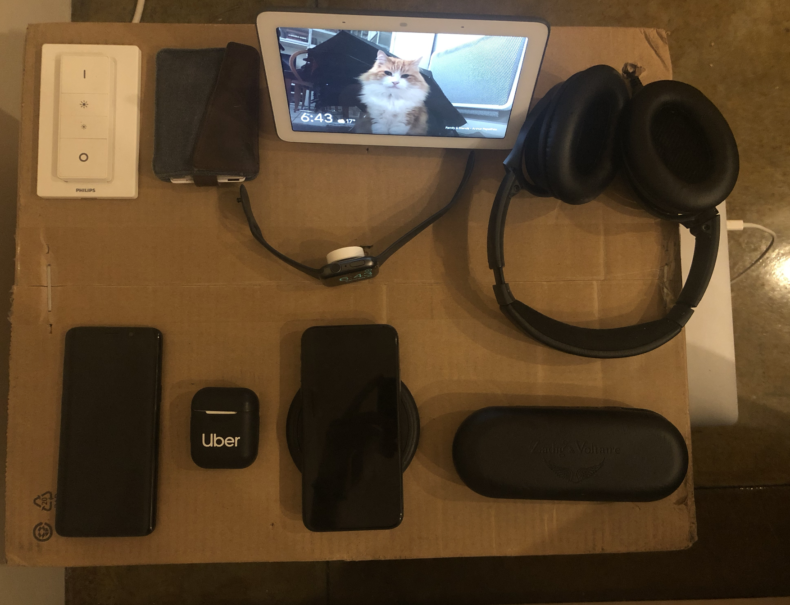
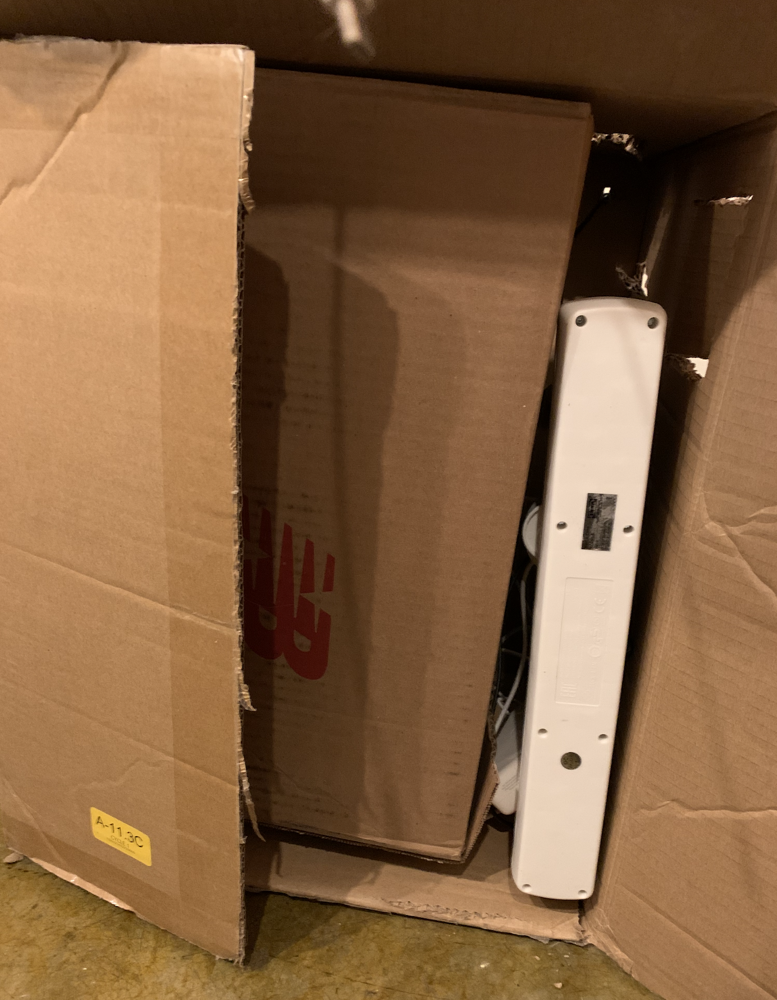
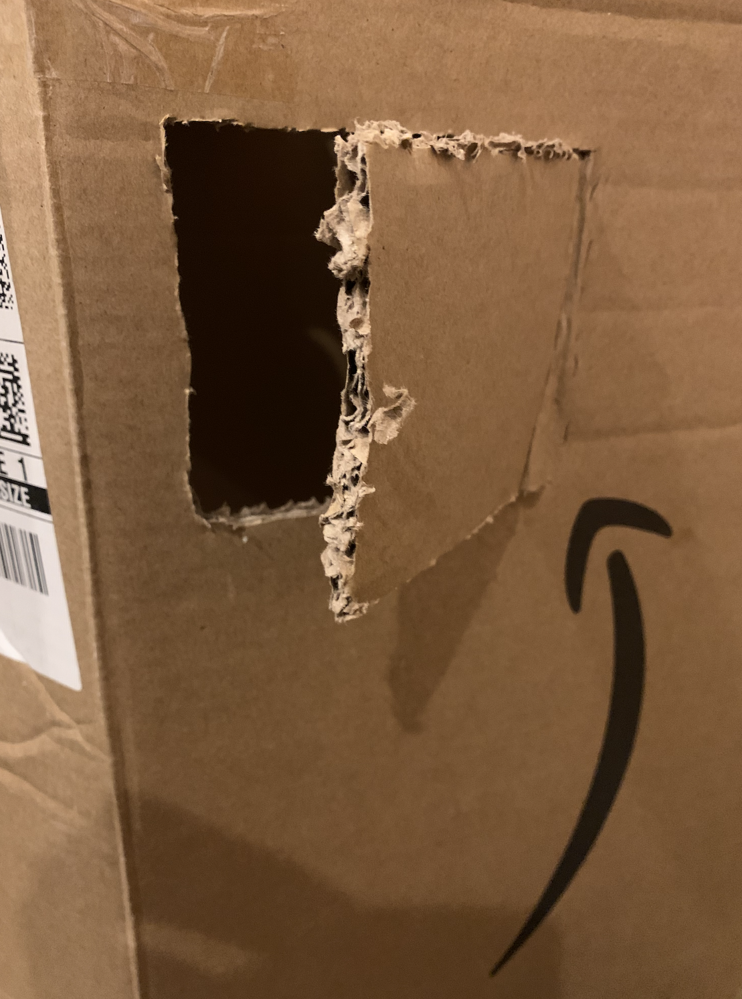

_Random article describing a random saturday afternoon of quarantine._

When I moved to my new place in SF I forgot to buy a nightstand, it was simply not on my list.  
But I quickly felt the need to have one to put my phone, headphones etc next to my bed.  
I had a box, from Amazon, so I used it as a nightstand for many months.

- First problem  
It happens quite often that I use my computer before sleeping, and when I'm done I just put it on the floor next to my bed, which is no bueno!

- Second problem  
All these cables outside of the box became super messy, cable management is hard!

- Third problem  
Which is not really a problem but not a taste, I would prefer to not see the cables going everywhere, let's do something clean.

I needed a solution...

-----------------------

I had the idea to create a place for my computer inside the box-nightstand, using another box.

The two boxes would look like:

Click [here](https://www.youtube.com/watch?v=dVpYiGXWpVA) to see the video of the Work In Progress nightstand: a hole + the small box inside the big one.

`First problem` solved! 🥳

And for the `second problem`... well, let's just put all the cables inside the box 🙃  
It was just a perfect match! 👩‍❤️‍👨

But what about, if I want to add sometimes else to charge, should I really remove everything?  
Obviously not, I created the first Amazon Window, sold separately, where you can access the only single slot still available for urgent need of charge.

What about the `third problem`?

Well, let's just create more holes and we should be good to go!

Click [here](https://www.youtube.com/watch?v=KxRz7Igzli4) to see the full demo of this brand new Amazon Nightstand 2020.

You can 👇 `Subscribe to the Newsletter` 👇 if you want to preorder. ☺️

PS: I might or might not improve the design, paint it, put something on top...