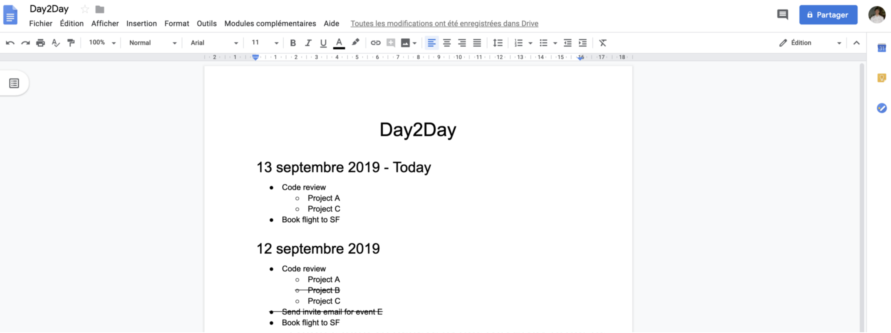

## What is Day2Day?

Day2Day is a task manager I wrote soperating on Google Docs.  
It’s simple and it just works. 😃  
I have tried a lot of productivity apps, some are great but too overwhelming. Lots of features that I don’t need, it becomes hard to do simple things.

## Why would I use Day2Day?

Well, let’s see what people think about it:

_“All of a sudden, I was able to leave my office by 3pm!”_ — Marta  
_“I didn’t want to believe it, but Day2Day brought order to my life!”_ — Pierre  
_“My productivity increased by +200% after using Day2Day for only 1 day! 🤯”_ — Pavel  

## How does Day2Day work?

Every day, you will write your tasks and subtasks on a Google Docs, following the pre-filled template provided by my script.  
In order to mark the task as done, you only have to strikethrough it. (Cmd+shift+x on Mac or Alt+Shift+5 on Windows/Linux)  
The script will be run automatically every weekday at midnight, will copy the uncompleted tasks from the previous day and paste it to the new day.  
No need for any manual work here. 🥳

## Motivation & Previous work

I am using this Google Docs for daily tasks for a few years now. I always found it too much to copy-paste the previous day, to remove the completed tasks, every single day. (Yes, I like automation! 🤖)  

So I wrote a React Web App to do this job for me, the code is available here. But after a while, it became too complex for the simple task manager I needed, so I wrote Day2Day on Google App Script. (ie, the content of this article)  

You can see a quick demo of my previous work:

It would also generate what you have to say for your team **Standup**. 😅

There is also a Markdown editor useful to simply store important information, that you might want to quickly find for instance when it’s time for Promo season in your company.

## How to set Day2Day up?
You can follow these 8 simple steps:  
I don't want this article to be too long here, so please go to [my original medium article](https://medium.com/@papay0/day2day-task-manager-operating-on-google-docs-bca099d75e45) and the 8 easy steps are explained. 😈

You can now start writing your tasks following the same pattern as the picture on the top of this article, ie using bulleted lists.

Enjoy! 🥳

## How to contribute 🤩
Day2Day is open sourced!  
Simply go to the [GitHub project](https://github.com/papay0/Day2Day) and go for it, I’m waiting for your PR 😃