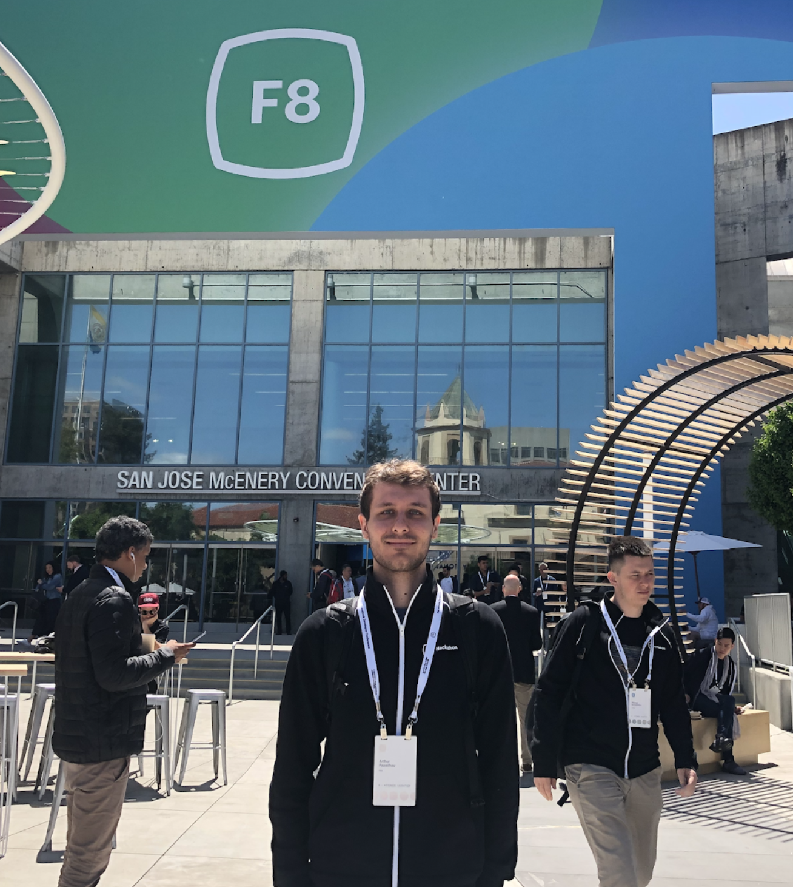
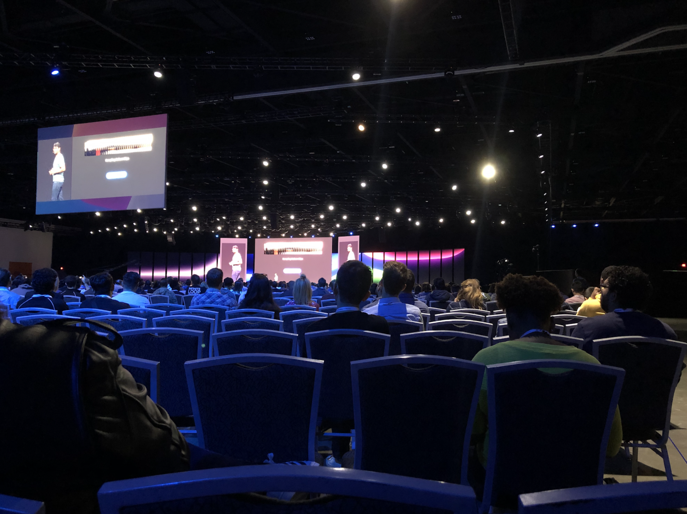
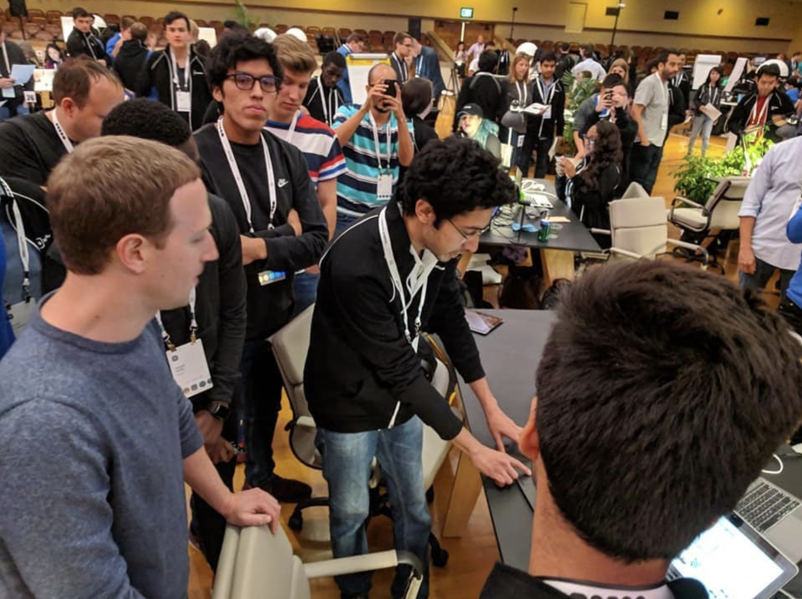
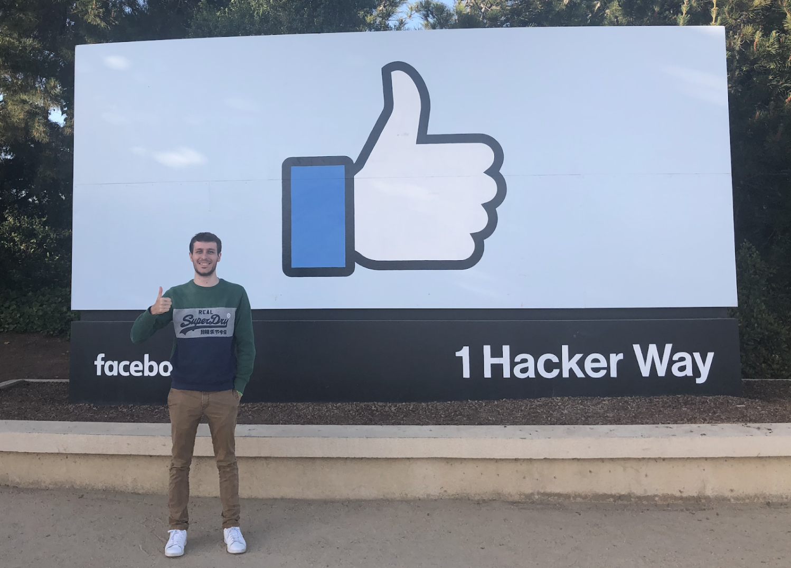

# F8 / Hackathon 2019
_April 28th - May 1st 2019_

## What is F8?
F8 is the annual developer conference organized by Facebook.
They usually present their latest research and products.

## Why did they invite me?
Good question.

## What was the schedule?
48 hours hackathon and then two days of F8 conference.
I landed on Saturday, and hackathon started Sunday morning, without much sleep for 48 hours.
So… I can say that my body’s internal clock was a bit lost, for me and for almost 200 other people!

## What was the hackathon about?
[Help enable the best of what people can do together.](https://f82019.devpost.com/)

Facebook invited a representative of the United Nation to talk about SDGs, Sustainable Development Goals.

They encouraged us to focus on one of the four SDGs:  
- SDG 4: Ensuring inclusive and equitable quality education and promoting lifelong learning opportunities for all.
- SDG 8: Promoting sustained, inclusive and sustainable economic growth, full and productive employment and decent work for all.
- SDG 9: Building resilient infrastructure, promoting inclusive and sustainable industrialization and fostering innovation.
- SDG 11: Make cities and human settlements inclusive, safe, resilient and sustainable.

## How did I select my team?
Facebook invited all the participants (200 people) in a Facebook group.
We had to describe ourselves and our technical skills.
Almost everyone had the same skills (iOS/Android, React, Node.js, AR etc) so I had to use another criteria to choose people.
Someone had a profile picture with a cat, another one sent a GIF with a cat, I like cats so we created a team. Turned out it was a really good way of selection. I highly advise!

Should we rethink our interview process @Uber? 🤔

My team is composed of two full-stack developers, a designer and myself.

## Why did they invite me?
I answered a questionnaire when I signed up to watch the F8 online and Facebook selected 200 people to participate to the hackathon and join the F8. People from all over the world. Literally **all over the world**! 🌎🌍🌏

## Where was it?
- Hackathon: Facebook rented the [National Civic Center](https://www.google.com/search?q=national+civic+center+san+jose&source=lnms&tbm=isch&sa=X&ved=0ahUKEwjKt_TE5P3hAhUJtlkKHVtrBxcQ_AUIECgD&biw=1680&bih=916) in San Jose for 2 days. INCREDIBLE building!
- F8 Conference: In the [San Jose McEnery Convention Center](https://www.sanjose.org/convention-center), where the WWDC usually happens. 🥰

_Hackathon_

_Keynote_

## What have we built?
We built a [solution](https://devpost.com/software/my-city) for SDG 11, to create a community of people to improve the cities.

Do you know [311](https://www.govtech.com/dc/articles/What-is-311.html)? It’s an app to report issues in the cities.
311 exists in a few cities and are managed independently per cities.

We created a solution that makes the reporting easier for citizens and easier for the city to manage issues.

1. We created a Messenger bot for the reporting part.  
It asks to send a picture of the issue (eg a pothole), we use Image Labeling Detection to suggest to the user what the issue is about, so that he/she doesn’t have to type.
We then ask the user to send the location.

2. A dashboard for the City to see all the issues on the map, be able to mark them as done, filter by categories etc.

3. A React Native application to see the issues, select and start the navigation to the issue location.

4. A gamification system so that the more you report the more points you earn. (we didn’t have time to go further than that, like prizes etc)

I don’t think the bot is available to the public because it needs to be reviewed by Facebook. It’s only available for testers, ie our team.
It was my first time creating a bot and creating a React Native application, I had lots of fun learning & building in 48 hours!

## How was it?
Facebook impressed everyone with the organization.
They rented an amazing place, planned all the food and goodies we could think of.
They installed couches and beds for those who wanted to sleep as well as organized activities.
They gave Uber Vouchers during all the event to do Hotel <--> Hackathon place.

I met some incredible, talented and smart people from all over the world.
I absolutely loved my time there.
I’m currently pretty sad that it’s over, now that I write these lines… what just happened is hard to believe, like it's too good to be true.

It was all I could dream of, amazing projects to work one, access to Facebook engineers & experts in any domain if we had any questions. (AI, ML, all their tools etc ...)

They selected 200 people, and I think it was ~ 100 men and 100 women.  
Everyone was there for the same reason, sharing the same passion: technology!  
It was not only engineers, my guess is 60/70% engineers and the remaining % are designers, marketing, all sharing the same passion. 🥰

## My friend Mark
_Or Marko as I call him when we chat on Messenger_

Mark came to see our projects at the end of the hackathon. He selected random groups to talk to. He unfortunately didn’t select our group. But he was lucky enough to be standing one meter away from me.
We also saw him for the opening keynote.

## Engineering at Facebook
I had the opportunity to talk to a lot of engineers there and to learn more about the engineering inside of the company.
The good news is, it’s as messy as Uber!  
_It's messy compared to my expectation of these kind of companies, but it's incredible!_

This is a [video](https://vimeo.com/242899818?fbclid=IwAR1Xm2iHMOcrw6uZKbJ9xuriZDRKSU55Ae5xeFzMHGCOocENfzK1V330dWs) about the Design System at Facebook, how they collaborate between Engineers and Designers etc. I was amazed. From the video we can see that Facebook is next level.  
Now that I talked to them, I still believe there are ahead of Uber in many ways, but not as much as I thought.  
They told me that their codebase is super hacky, many teams are building the same features etc. For example Stories, they have Messenger Stories, WhatsApp Stories, Insta Stories, Facebook Stories… all built by different people without sharing any code!

They announced the new Messenger, which is Harder Better Faster Stronger, but I learned that it’s still mainly written in C and Obj-C. 😢

_Update - March 2nd, 2020:_ Facebook release an [article](https://engineering.fb.com/data-infrastructure/messenger/) describing the rewrite of Messenger.

Funny story about this new app;
The main thing is about memory, the app should only be ~30MB, current 130MB.
So the way they decide if a feature can go to production or not is by looking at the memory size of the feature!  
The have a memory budget per team, like they have only 5MB per team and they have to work with that, I found that hilarious!

Another point, they rewrite 100% of the app, so they won’t be able to A/B test for iOS because no dual binary possible.

_Update - February 26th, 2020:_ A friend working in Messenger told me that they have both apps in the same app, but not dual binary (cannot do that on iOS, as opposed to Android) but they have like kinda the two roots of the two apps in the same binary. I honestly don't know how they do that. I can imagine but still hard to believe!

There was a giant Hall with all the products, so I was able to learn from almost every teams. (Instagram, Messenger, Oculus, Workplace, AI at Facebook, Spark AR)

_I was representing Uber at Facebook, I tried to hire them, it's a work in progress!_

## Hackathon Pitching
All hackathon participant missed the sessions for the first day because we were pitching to the jury.
Mark was there at the beginning of the pitching sessions.  
Three juries composed by two people each came to us to listen to our pitch/demo.
It was super strict, 2 minutes with a chrono, no more.  
It went well.  
We had to pitch a fourth time, we guess it was because we were ex aequo to be in the finalists.
…
We didn’t make it to the finalists! 😢

## Conference sessions
I can only advise to check [this list of videos](https://developers.facebook.com/videos/) and to select based on interest.

## Funny story about the F8 registration
When I signed up to participate in the hackathon I didn’t know they would pay for the flight, hotel etc. And I didn’t know they would invite people to F8 based on that. I just signed up in case I’d be in SF during that time.  
They send me an email saying “You’re invited to F8”.  
I didn’t even read this email because I thought “Yes sure thank you, I’m invited to pay for the ticket.”

A few weeks later, they sent me another email saying that I didn’t officially registered for the hackathon, so I clicked on the email, I saw a form to fill in. It was one month before the conference and I knew I wouldn’t be in SF, so I didn’t complete the online form.

One week later, they sent me another email saying _“We’re following up on your invitation for F8 2019 and the Hackathon. You have not yet registered and we’re hoping that you can join us. 
The Hackathon has limited seats and **includes sponsorship for air travel and hotel accommodations**, if needed. If you will not be able to attend, we’d like to offer your spot to another applicant.”_

When I saw that email I thought it was a scam… so I contacted them and asked “what do you mean by _includes sponsorship for air travel and hotel accommodations_?” because that was out of nowhere!  
So they answered that they would pay for everything etc. I couldn’t believe it! 😂

## Conclusion
The past few days were incredible.  
I met so many talented people from all over the world.  
I learned a lot about engineering and about Facebook’s organization from the inside.
Uber is using a lot of Facebook tools (Phab, Buck, React, ...) so it was interesting to talk to them in real life.  
I think I took every opportunity to talk and learn from them and how they work.

Thanks for reading!

