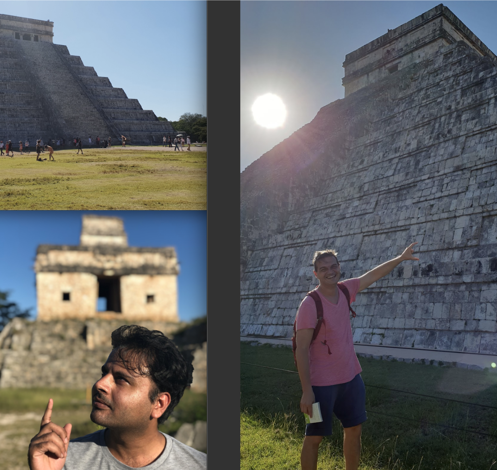
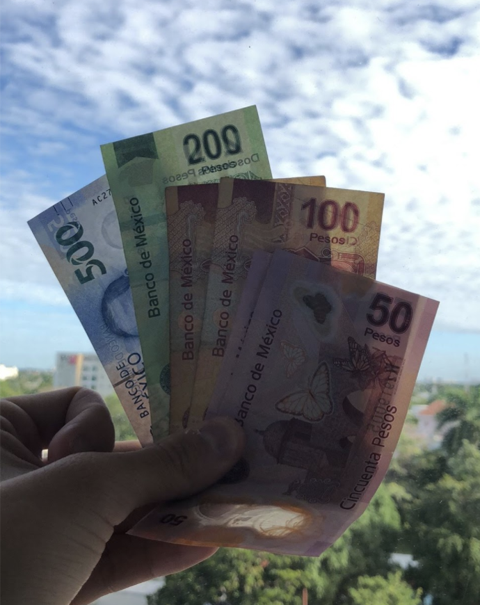
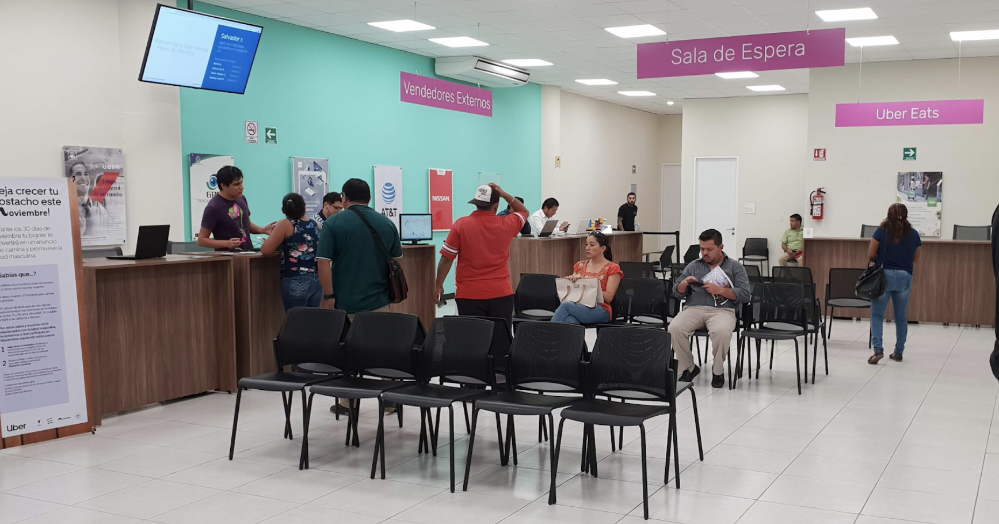
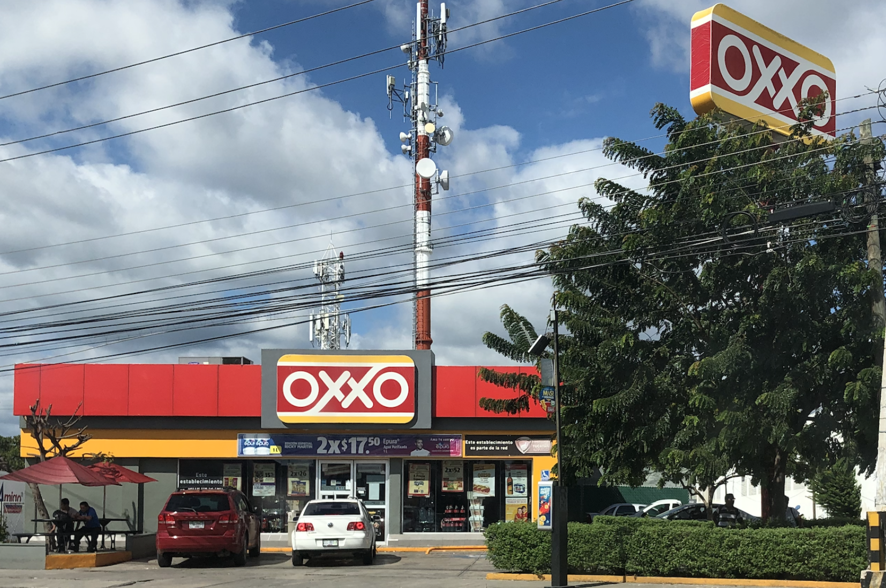
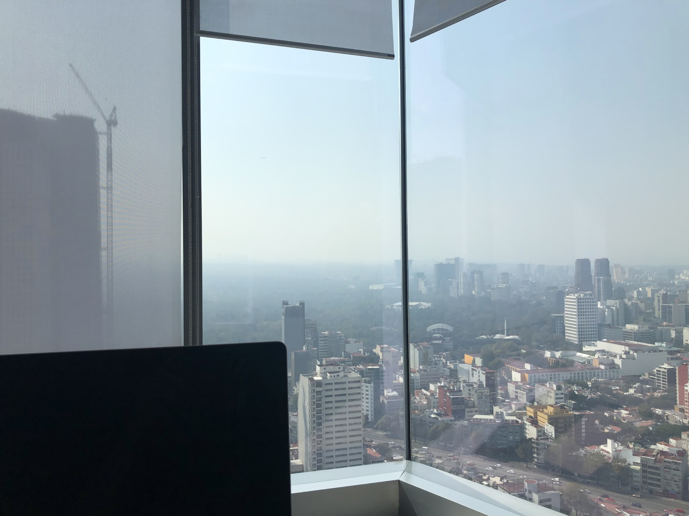

A few words before the article:
- This was originally written to share internally at Uber. I removed all internal knowledge.
- "Retriever" is a name of an Uber project, about Uber Partners & Cash. (Payment method 💵)
- Uber, as a business, is taking a % on every trip. But when the trip is paid with Cash, Uber doesn't directly have access to this money because it's directly paid by Cash between the rider and the driver. Retriever is about Uber collecting this money. I won't go into details. 

# Research trip in Mexico - Retriever 🇲🇽
_16-11-18/23-11-18_

The goal of this research trip was to understand the impact of Retriever, as well as other cash features, and see what can be improved.  
I would like to thank all of my Uber team for letting me go with you!  
Here are some thoughts/learnings about this previous week:

## Expectation 🤔  
I wanted to go to this research trip because I wanted to see Retriever in real life.
I was expecting to also discover Mexico, this “dangerous” country.  
I’ve been hearing about OXXO every day for more than 6 months, so I was expecting to learn more about this “OXXO”, which was for me just a shop, like Albert Heijn in The Netherlands. 🇳🇱  
I was expecting Mexico to be a cash only city, like 90% of trips would be with cash.

## Reality / Learnings 🤯  
Retriever 👏
This project is my first production project at Uber.  
I’ve been working on it for around 8 months. (at the time of writing this)  
Even if I knew what Retriever was about, seeing this project in production “in real life”, and not just through our online metrics, adds a lot of value to it.  
It makes me realize even more that we’re building this feature for real people, and that it directly impacts their day, the way they work, so their life.  
A few things surprised me about the way drivers handle Retriever.

First, when they receive the notification “Payment due in 7 days”, they decide/hope to take more card trips so that their arrears will go down. I was surprised to see how well they were aware of that.  
If one day I’d receive this kind of notification, it’s a no brainer, I’d just go and pay right away!  
Second, drivers were used to the previous way of handling arrears; a link in an email.  
Building a new flow/solution can seem straightforward for many of us, but I realized that many drivers were looking for a link to click, somewhere in the Retriever flow, so they were confused.  
This research trip showed me that it’s not as simple as pushing a new feature in production and expecting everyone to adopt it.  
Lastly, Retriever clearly impacts the way drivers plan their day.  
Some were saying that they prefered to pay at OXXO rather than paying the arrears with a card.  
In order to do that, they need to take a break in their day. For some it was early in the morning before the beginning of their busy day, for others it was during the lunch break etc.  

To conclude on that part, this week really showed me that our work directly impacts life of drivers.  
_I knew that before, but didn’t realize it as much as now._

## Mexico 🇲🇽
I discovered this country through two cities; Merida and Mexico City.  
We were in Merida on Sunday, so we all took this opportunity to visit the state of Yucatan.  
I also learned from my parents that I went to Yucatan when I was younger.  
Conclusion, think twice before bringing kids on a trip with you, because I didn’t remember much of my first time there! 🙄  
I was surprised by the temperature difference between Merida (+30C) and Mexico City (+20C).  
Many people told me that Mexico wasn’t safe.  
I felt that Merida was safe, nice and kid friendly.  
I have only been in the financial area of Mexico City, and it felt a bit less safe than Merida, but still okay to walk in the street by myself. I talked to a few people at the office about the safety of this city, they told me that they could walk alone in the city, maybe not at 4am.  
Of course, like in any city, there are places not safe at all. Maybe more in Mexico City than Amsterdam!  
Conclusion on safety: positively surprised. 👍

## Cash 💵
I was expecting 90% of trips to be with cash.  
Turns out it is less than that.  
I asked this question to all my drivers, and on average it seems to be around 60%.  
Some were saying 50/50, other 70/30 and even 80/20, all for more cash than card trips.  

Drivers knew exactly where to go to have more cash or card trips, for example they knew that north was a card trip area, and south was for cash. (or the opposite I don't remember well)

## Research process ⚙️📚
I didn’t know what was a research trip. For me, it was mainly about talking to people and learn from them.  
And… it might be a great way to sum it up. 😇  

But of course there are some processes, it’s not just about talking.  
Here are a few that I discovered:

### Trip taking / Drive Along
I was sick on that day so I couldn’t join.  
But from what I understood, a team of 3 or 4 people are taking trips, ask questions to the driver, and at the end of the trip they show a prototype and ask the driver to test it. (without ending the trip on the app)  

The team can be composed by:
- a translator
- someone to take note
- someone to lead the conversation
- and maybe someone to record

### Testing prototype in a greenlight
Ops (Operation people) asked drivers from the greenlight if they could give 30 minutes / 1 hour of their time to answer a few questions, with compensation in return.  
The researcher starts with a few general questions to make the driver comfortable.  
Then asked questions related to Retriever.  
Finally, prototype testing.  
Interviewing for research (same as interviewing to hire someone) is hard.  
We know the project, the context, they don’t necessarily know it. We need to make sure that the driver doesn’t stress, that he/she knows there is no wrong answers and can talk freely etc.  

The first driver was not really demonstrative, which made it hard to receive good signals.  
The second one was, at the beginning, demonstrative, smiling, not stressed, making jokes etc.  
And after 20 minutes I realized he wasn’t exactly as natural. He was stressed, afraid to make mistake playing with the prototype. This confirms that interviewing is hard!  

### Roundtable in a greenlight
This type of interview was my favorite.  
We did two roundtable interviews. The first one with 17 drivers, the second with ~10 drivers.  
I particularly liked the process:  
- 10/17 drivers telling their stories, answering questions
- 1 translator
- 1 lead for the overall discussion
- 1 to take notes
- 1 to focus on the discussion and ask more questions if needed

The first session was hard to follow because we had to listen to the translator, and ~ 17 people were talking at the same time, in Spanish.  
The second session was perfect. The translator had a microphone, was connected on zoom so that we only had to listen to the english voice. Way easier to follow!  

This category of interview was my favorite because I felt that the drivers had the freedom to talk. I guess it’s because they were not alone with us, they had 16 other people with them doing the same activity.  
It was also sometimes really emotional.  

## Ops 🙏

### Ops / Greenlight
We went to the Greenlight in Merida and met the ops team.  
These two days made me realize even more that building Retriever is not only about building the feature, but also about educating drivers to this new way of handling arrears.  
Ops in the greenlight have to perfectly know everything in order to handle all kind of problems a driver can have. More specifically about Retriever, they were teaching drivers how Retriever works via videos.  

### Ops / non-Greenlight
Sorry in advance if the real name is not “Ops” but “Community Operations Manager” or “Customer Support Coordinator” or “Regional Operations Manager” or “Operations Coordinator” or ... I'm a bit confused about which one is correct here.  
When I went to the Mexico City Uber office, we had a meeting with “Ops”. (more specifically all titles from above)  
That was the missing part of the puzzle, meaning, they are managing Retriever Latam on a higher level.  
I have now a better knowledge/understanding about how Retriever works, but also about how any feature works at Uber.  

## Spanish 🗣
I studied Spanish from my 14 to my 19 years old.  
Fun fact, I hated Spanish at school. I should have studied Spanish until my 21, but I discovered how to make it stop before.  
Spanish was mandatory, but I learned that if I would fail my English exam, I would stop Spanish in order to focus on my English classes. Guess what I did 😇. (on purpose... or not 😅)  
What surprised me is how fast it came back to me. I almost understood what my driver was telling me! And I was able to pay at OXXO in Spanish! 👏  
This research trip made me want to learn Spanish again... we will see if I still think the same in 2 or 3 weeks.  
_Update:_ This did not last 2 days.

## OXXO 💰
I thought OXXO was just a shop where people could also pay bills with an invoice.  
But OXXO is way more than that.  
First of all, it’s everywhere, literally everywhere!  
Then, OXXO has a payment method named OXXO Pay. It’s also a bank.  
OXXO is part of Mexico.  

And thanks to OXXO, I became a full-stack tester.  
I tested my code with Unit tests, Snapshot tests, End-to-end tests, and now also with real-life test!  

## Mexico City Uber office 🌆
The office is impressive.  
Apparently the address should stay secret for non-Uber employees.  
Security is not a joke. If you want to enter, you need to ... _this part is removed from this post, for Uber employees only, sorry :)_  
I didn’t see much except the cafeteria.  
Let’s talk food; snacks are amazing. Lunch is not.  
Here is a picture of the view from the office.  

## Salsa
The last night before leaving, we went to a salsa place after dinner.  
I loved the atmosphere, live music, people dancing everywhere.  
We also all went dancing with Uber employees from the Mexico city office, just to try… and I can tell you that unfortunately I am very bad at it. My first salsa dance was not a success!

# Conclusion
This research trip was full of learnings.  
I advise everyone to go if you have the opportunity.  
It was also a good 1-week team building event; I “knew” everyone from this trip already, but after this week I feel like I know them 200% more than before. It will make it easier to work together in the future. 👍